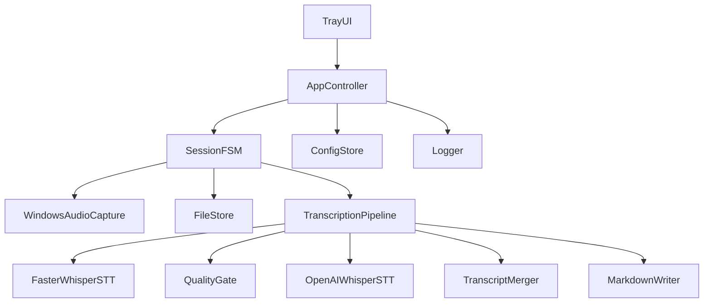
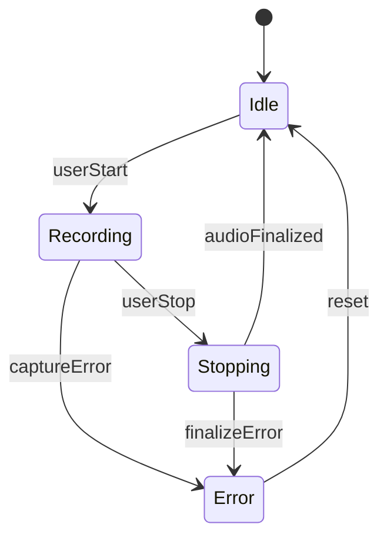
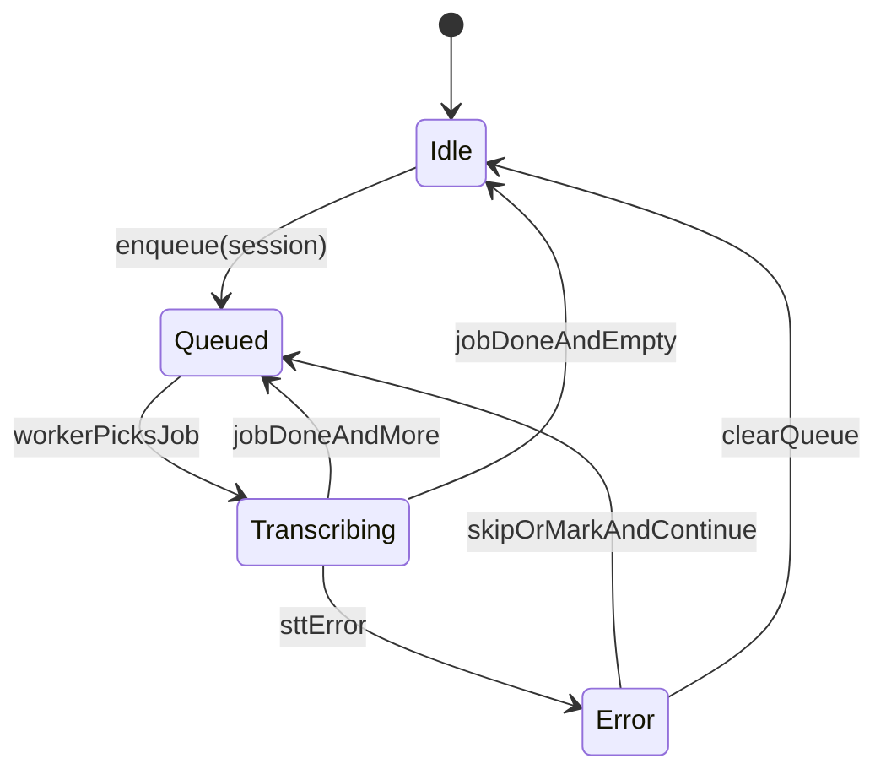

# Technical Design Document — Windows tray app (v1, один процесс)

## Краткое описание

Этот документ описывает **v1 Windows-приложение в системном трее** для Callscribe, реализованное как **один процесс ОС** (без отдельного background service). Tray-приложение отвечает за:

- минимальный UI (иконка в трее, меню, статус)
- оркестрацию сессий записи (в MVP — ручной старт/стоп; авто-детект по процессам можно добавить позже)
- платформенный захват аудио (WASAPI loopback + микрофон)
- запуск пайплайна транскрипции (локально `faster-whisper`, опциональная эскалация в remote)
- запись результатов в настроенную папку (`.md`, при этом raw audio всегда сохраняется)

Скоуп соответствует Roadmap v1 в `README.md`.

## Цели (v1)

- **Tray app в одном процессе**: один Python-процесс хостит UI и фоновые циклы оркестрации.
- **Ручной контроль записи**: Start/Stop из трея достаточно для MVP.
- **Понятный статус**: idle / recording / transcribing / error.
- **Raw audio всегда сохраняется**: для каждой сессии, даже если транскрипция упала.
- **Локальная транскрипция в первую очередь**: `faster-whisper` даёт timestamps + confidence signals.
- **Экспорт** итогового транскрипта в Markdown (`.md`) в настроенную папку.

## Не-цели (v1)

- Транскрипция в real-time (достаточно batch по завершению сессии)
- Multi-user / cloud sync
- Mobile
- Paid/closed model
- Кроссплатформенный GUI (Flutter и т.п.)

## Ключевые допущения

- ОС: **Windows**.
- UI: **system tray** (например, `pystray` + `Pillow`).
- Иконка: **bundled** `logo.svg` → трей и окно настроек; на тёмном shell Windows растр инвертируется для контраста.
- Захват аудио: **WASAPI loopback** + микрофон.
- В WAV: **loopback как стерео** (L/R с устройства, при многоканале — первые два канала), **микрофон в моно**, затем **дублирование в оба канала** и суммирование с loopback (не «система в левое, микрофон в правое»).
- Стек v1 (по `README.md`): Python `psutil`, `soundcard`, `faster-whisper`, `pystray`, `openai`.

## Пользовательский опыт (UX)

### First-run (минимум)

Если приложение запускается впервые и `output_folder` не настроен:

- состояние в трее отображается как `Needs_setup` (или `Error` с понятным текстом)
- пункты **Start recording**/**Stop recording** отключены
- доступен быстрый путь в настройку:
  - **Settings…** открывает окно: папка вывода, устройство loopback (системный звук), микрофон; результат сохраняется в `config.toml` (диалог и **Open output folder** выполняются вне блокировки asyncio-цикла: отдельный поток Tk и `to_thread` для открытия папки).
  - при необходимости можно править конфиг-файл вручную (fallback)

### Меню трея (минимум)

- **Start recording** (недоступно во время записи)
- **Stop recording** (недоступно в idle)
- **Open output folder**
- **Settings…** (папка вывода + loopback + микрофон; позже: processes, thresholds)
- **Quit**

### Логирование (v1)

- В файл пишется подробный лог (`DEBUG`) для пространства имён `callscribe`.
- В консоль по умолчанию — более короткий формат и уровень не ниже `INFO`; отключение консоли: переменная окружения `CALLSCRIBE_LOG_CONSOLE=0` (см. `README.md`).
- В `CALLSCRIBE_TEST_MODE=1` поток в консоль подключается только при `CALLSCRIBE_LOG_STDOUT=1`.
### Индикация статуса

- Иконка/tooltip отражает состояние **записи** и может дополнительно показывать фоновую **транскрипцию**.
- Минимально (для MVP) достаточно статусов записи: `Idle | Recording | Error | Needs_setup`.
- Если транскрипция идёт в фоне, tooltip может показывать вторую строку/суффикс: `Transcribing (background)`.
- Уведомление ОС на Start/Stop — **should** (приятно, но можно отложить, если тормозит MVP).

## Архитектура

### Диаграмма компонентов (один процесс)

## Definition of Done (DoD) по модулям (v1)

Этот раздел переводит рекомендации/риски в **конкретные, проверяемые требования** к реализации v1.

### TrayUI

- В трее есть меню с пунктами: Start/Stop/Open output folder/Settings/Quit.
- Пункты Start/Stop корректно enabled/disabled в зависимости от состояния.
- Tooltip показывает состояние `Idle|Recording|Error|Needs_setup` и, при наличии фоновой транскрипции, дополнительную пометку `Transcribing (background)`.
- При `Error` отображается короткое сообщение (tooltip) и есть путь “что делать дальше” (Settings/Open config).

### AppController

- Любое действие пользователя (Start/Stop/Quit) не блокирует UI loop.
- При Quit во время записи выполняется корректная последовательность:
  - инициировать Stop
  - дождаться finalize (или таймаут с fail-safe поведением)
  - после этого завершать процесс
- Состояние приложения является “single source of truth” и обновляется атомарно (без гонок между UI и worker).

### ConfigStore

- При старте читает конфиг и определяет `output_folder`.
- Если `output_folder` отсутствует/некорректен:
  - приложение переходит в `Needs_setup` (или `Error` с понятным текстом)
  - Start recording отключён
- Settings… позволяет настроить `output_folder`, `loopback_speaker_name`, `microphone_name` и сохранить конфиг одной записью.
- Формат хранения: один TOML-файл (путь вида `%APPDATA%/Callscribe/config.toml` или эквивалент).

### FileStore

- Создаёт структуру сессии под `output_folder`:
  - `YYYY-MM-DD/YYYYMMDD-HHMMSS-sessionId/`
- Возвращает детерминированные пути для `audio.wav`, `transcript.md` (и опционально `session.json`).
- Гарантирует, что директории созданы до старта записи.

### WindowsAudioCapture

- На Start:
  - стартует захват `system+mic`
  - пишет raw WAV в путь `audio.wav` (или иной raw-формат, но фиксированный для v1)
- На Stop:
  - гарантированно закрывает/flush-ит файл
  - возвращает факт `audioFinalized` только после успешного finalize
- При ошибке:
  - сообщает её наверх (SessionFSM/Error) и не оставляет “подвешенные” файловые дескрипторы

### TranscriptionPipeline

- Запускается только после `audioFinalized`.
- Всегда пытается выполнить local STT (`faster-whisper`).
- Remote fallback:
  - если нет ключа/remote выключен → pipeline не падает, работает local-only
  - remote ошибки/лимиты не валят всю сессию: деградация в local-only (по сегментам/целому прогону)
- Merge:
  - итоговый текст собирается в один transcript; timestamps остаются от local
- При падении STT:
  - raw audio остаётся
  - (опционально) создаётся `transcript.md` с краткой диагностикой, если это не мешает UX

### QualityGate (если включён в v1)

- Имеет дефолтные пороги (чтобы работало “из коробки”).
- Пишет routing audit лог:
  - `segment_id`, `start_ms`, `end_ms`, `avg_logprob` (или эквивалент), `accept|escalate`, причина

### MarkdownWriter

- Пишет `transcript.md` в директорию сессии.
- Контракт заголовка включает:
  - start time
  - end time или duration (и duration всегда)
  - source `system+mic`
  - version строку (например `v1-local-first`)
- Тело содержит:
  - сегменты с таймкодами
  - merged текст (remote замены, где применимо)

### Ответственность модулей

- **TrayUI**
  - владеет иконкой + меню
  - эмитит пользовательские интенты: Start/Stop/OpenFolder/Settings/Quit
  - отображает текущее состояние + последнюю ошибку (коротко)

- **AppController**
  - связывает UI с доменной логикой
  - хостит фоновые циклы (recording, transcription) в том же процессе
  - обеспечивает корректное завершение (shutdown) по Quit

- **SessionFSM**
  - конечный автомат жизненного цикла сессии записи
  - держит инварианты: raw audio сохранён, переходы валидны, ошибки видимы

- **WindowsAudioCapture**
  - старт/стоп захвата
  - пишет raw audio файл (например, WAV) с детерминированным именованием и flush поведенем

- **TranscriptionPipeline**
  - запускает локальный STT на записанном аудио
  - опционально эскалирует low-confidence сегменты в remote STT
  - мерджит результат и пишет `.md`

- **ConfigStore**
  - читает/пишет минимальный v1 конфиг: output folder; позже thresholds + process list

- **FileStore**
  - задаёт структуру директорий и имена файлов для сессии
  - гарантирует: raw audio записан на диск до старта транскрипции

## State machine (запись и транскрипция — раздельно)

Чтобы **фоновая транскрипция не мешала записи**, в v1 используем две независимые машины состояний:

- **RecordingFSM**: управляет только захватом аудио и финализацией raw файла.
- **TranscriptionFSM**: управляет обработкой финализированных сессий в фоне (очередь работ).

### RecordingFSM — состояния и переходы

Состояния:

- `Idle`
- `Recording`
- `Stopping` (finalize capture; flush files)
- `Error`

### TranscriptionFSM — состояния и переходы

Состояния:

- `Idle`
- `Queued` (есть финализированные сессии в очереди)
- `Transcribing` (обработка текущей сессии)
- `Error` (ошибка на текущей задаче; очередь может продолжить работу)

### Инварианты

- **Raw audio никогда не выбрасывается** после создания для сессии.
- `TranscriptionFSM` получает работу **только** после `audioFinalized`.
- Повторный `userStart` (новая запись) возможен, даже если `TranscriptionFSM=Transcribing`.
- `Quit` во время `Recording` вызывает Stop → Finalize; транскрипцию можно:
  - дождаться для текущей задачи (если быстро), **или**
  - корректно остановить worker и оставить raw+частичные артефакты (fail-safe).

## Данные и хранение

### Структура выходных файлов (предложение)

Внутри настроенной `output_folder/`:

- `YYYY-MM-DD/`
  - `YYYYMMDD-HHMMSS-sessionId/`
    - `audio.wav` (raw, всегда)
    - `transcript.md` (если транскрипция успешна; может быть частичной)
    - `session.json` (опционально для v1; если добавляем: минимальные метаданные + ошибки)

### Контракт содержимого Markdown (минимум)

- Заголовок:
  - время старта сессии
  - время завершения (или длительность, если end time недоступен)
  - длительность
  - источник захвата: `system+mic`
  - версия пайплайна (строка, например `v1-local-first`)
- Тело:
  - сегменты с таймкодами (из локальных timestamps)
  - merged текст (remote текст заменяет local там, где была эскалация)

## Конкурентность и модель потоков

`pystray` обычно имеет свой loop. Чтобы один процесс был предсказуемым:

- **UI thread**: event loop трея.
- **Worker thread**: долгие операции (recording, transcription), чтобы UI не фризился.
- Коммуникация:
  - потокобезопасная очередь/ивенты для интентов (Start/Stop/Quit) и state updates.
  - UI читает state snapshot (пуллингом или callback) и обновляет tooltip/disabled states.

## Обработка ошибок

### Принципы

- **Fail-safe**: raw audio сохраняется, даже если STT падает.
- **Crash-safe Stop**: на Stop сначала закрываем/flush-им raw audio файл, и только потом стартуем транскрипцию.
- **Частичный результат допустим**: если транскрипция упала, можно (опционально) создать `transcript.md` с краткой диагностикой, не затирая raw audio.
- Ошибки проявляются как:
  - tray state = `Error`
  - короткое сообщение (tooltip)
  - логи

### Ожидаемые классы фейлов

- Нет аудио-девайса / сбой WASAPI
- Нет прав на запись в output folder
- `faster-whisper` модель не скачана / runtime ошибка CPU/GPU
- Нет OpenAI key / network failure / rate limiting (remote опционален; деградация в local-only)

## Конфигурация

### Минимальные поля v1

- `output_folder` (обязательно)
- (позже в v1): `routing_thresholds` (опционально)
- (позже в v1): `call_processes` list (опционально)

### Формат хранения

Один человекочитаемый конфиг в профиле пользователя, например TOML:

- `%APPDATA%/Callscribe/config.toml` (или аналогично)

## Наблюдаемость (observability)

### Логи

- Info: события жизненного цикла сессии: start/stop/finalize/transcribe/export.
- Warning: remote fallback использован; ретраи.
- Error: исключения с коротким контекстом (session id, path).

### Логи маршрутизации (routing audit)

Для каждого сегмента (или агрегировано, если слишком шумно) логируем решение:

- `segment_id`, `start_ms`, `end_ms`
- метрика качества (например `avg_logprob`)
- решение `accept|escalate`
- причина (например `below_threshold`)

### Минимальные метрики (v1)

- длительность сессии
- latency транскрипции (local + remote)
- число эскалированных сегментов (если remote включён)

## Безопасность и приватность (v1)

- Raw audio и транскрипты по умолчанию хранятся **локально**.
- Remote STT отправляет только эскалированные сегменты (если включено).
- Обращение с API key:
  - v1 поддерживает режим “без ключа” → local-only (remote отключён).
  - remote ошибки/лимиты не должны ломать сессию: деградация в local-only для проблемных сегментов.

## План тестирования (практичный для v1)

### Unit tests (быстрые)

- тесты переходов `SessionFSM` (валидные/невалидные)
- `FileStore`: нейминг и создание директорий
- `MarkdownWriter`: форматирование с таймкодами
- `QualityGate`: поведение порогов

### Integration tests (Windows-only где нужно)

- Start/Stop захвата создаёт не пустой WAV
- End-to-end по короткому аудио-файлу: local STT → `.md`

### Ручной QA чеклист (MVP)

- Tray стартует, меню показывает корректные enabled/disabled
- Manual Start → state Recording; raw audio файл появляется
- Stop → аудио финализируется; транскрипция запускается; `.md` появляется
- Форсируем ошибку (плохой output path) → state Error; raw audio остаётся, если запись уже началась

## Открытые вопросы / follow-ups (в рамках v1)

- “Settings…” лучше как минимальный диалог или “открыть конфиг файл” в дефолтном редакторе?
- Нужно ли сохранять `session.json` в v1 (без SQLite) ради удобства дебага?

## Экспертная оценка и улучшения (PO / CTO / QA Lead / AI/ML)

### Главная сильная сторона

Документ хорошо держит **MVP-цепочку** и снижает риск “service complexity”: один процесс, UI не блокируется, raw audio — первичный артефакт.

### Главные риски

- **Риск 1 — UX первого запуска**: без явного first-run сценария пользователю сложно получить “первую ценность”.
- **Риск 2 — устойчивость к крешам**: запись/финализация должна быть максимально атомарной (особенно WAV flush/close).
- **Риск 3 — ключи и remote**: отсутствие ключа/сеть/лимиты должны приводить к корректной деградации в local-only.
- **Риск 4 — ложные автосрабатывания детекта**: поэтому manual start/stop — must; auto-detect — только после стабилизации.

### Рекомендованные улучшения (всё остаётся v1-совместимым)

1. **First-run flow (минимум)**:
   - если `output_folder` не задан, в tray state показывать “Needs setup” и вести в Settings/Open config.
2. **Контракт `.md` уточнить**:
   - добавить обязательные поля в header: start time, end time/duration, source, версия пайплайна (строка).
3. **Crash-safe запись**:
   - на Stop: сперва “закрыть/flush файл”, потом уже запускать STT.
   - при неожиданных исключениях: оставить raw, создать `transcript.md` с сообщением “transcription failed” (опционально).
4. **Remote fallback — строгая деградация**:
   - нет ключа → remote отключён, pipeline не падает.
   - remote ошибка → пометить сегменты как “local-only”, продолжить.
5. **Наблюдаемость для routing** (в логах):
   - для каждого сегмента: решение (accept/escalate) и метрика (например, avg_logprob).

